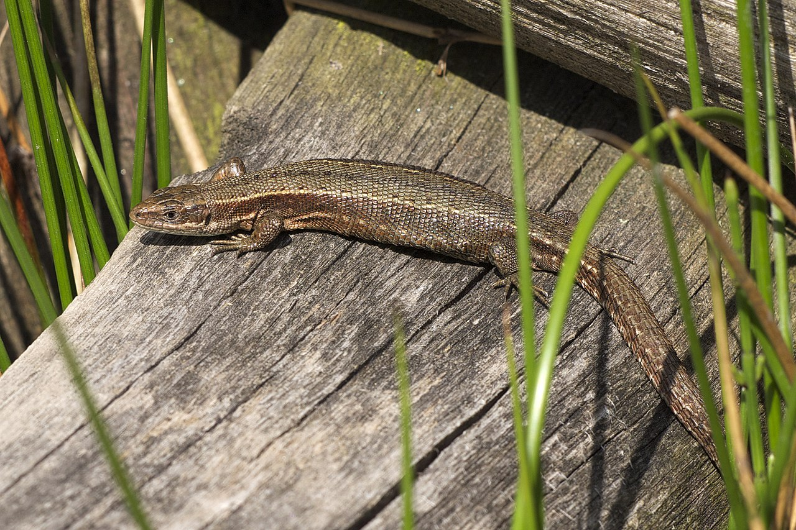

```{r setup, include=FALSE}
library(knitr)
knitr::opts_chunk$set(echo = TRUE)
```

## Introduction

In this lecture we will use power analysis to evaluate appropriate sample sizes for a simple experiment. You will gain an understanding of:

- One way of approaching the question of sample size
- How statistical tests can fail, and under what circumstances
- More advanced R coding concepts (loops, logic arguments)
- See an example of how to approach a coding project

There are 2 threads of understanding:

- **Conceptual**: understanding the statistical concepts and issues
- **Computational**: understanding the approach and techniques of the coding

Your revision materials for this lecture are:

- This set of notes
- The script that we will generate in the lecture, that you can download, manipulate and test

## Study system

We will consider a simple experiment based around the common lizard, *Zootoca vivipara* (Fig. 1).

```{r, out.width = "50%", dpi = 300, echo = FALSE, fig.align = "center", fig.cap="**Figure 1. *Zootoca vivipara*.	Jörg Hempel CC BY-SA 3.0 DE Deed**"}

```

You are studying 2 populations, Lizard population A lives in a sand dune system, lizard population B lives in a heathland system. Your preliminary investigations suggest the sand dune animals are bigger. You decide to test this hypothesis.

**H1: The mean snout-vent length of lizards in population A (dune) is larger than in population B (heath)**

**H0: There is no difference in mean snout-vent length between the populations**

You may further assume:

- Snout vent length is normally distributed
- The difference seems to be around 1cm, on average
- The variance is equal among populations (standard deviation 1 cm)

### How many samples do you need?

```{r, out.width = "70%", fig.width = 5, fig.height = 5, dpi = 300, echo = TRUE, fig.align = "center"}
# Script for carrying out power analysis for the lizard experiment

# declare variables
nsamp = 10
meanA = 10
meanB = 9
stdev = 1
x = 0
nreps = 100

# here I am just making an empty plot with sensible axes and labels
plot(1, type="n", xlim=c(0, 3), ylim=c(8, 11),
     xlab="population", ylab="snout-vent length (cm)",
     axes=FALSE
)

axis(1, at=c(1,2), labels=c("A", "B"), lwd=-1, lwd.ticks=1)
axis(2)

# here is the loop to repeat the analysis for nreps
for (i in 1:nreps) {

	# take nsamps from a normal distribution centred on true mean
	lizA <- rnorm(nsamp, meanA, stdev)
	lizB <- rnorm(nsamp, meanB, stdev)

	# add sample means to plot
	points(jitter(1), mean(lizA))
	points(jitter(2), mean(lizB))

	# run t test, increment x if significant
	my_t <- t.test(lizA, lizB)
	if(my_t$p.value < 0.05) {x = x + 1}
}

# add title reporting outcome of t tests
title(main=paste("p < 0.05 in", x, "out of", nreps, "tests"))
```
